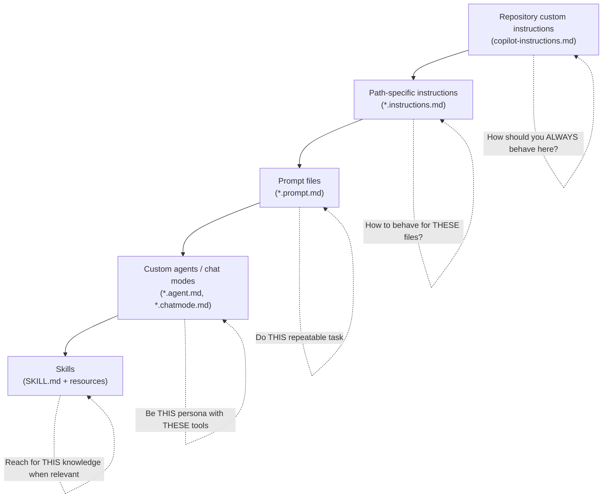

> Most teams I talk to use *one* Copilot customization feature, usually a single `copilot-instructions.md`, and then wonder why the AI still drifts off-style. The real win comes from knowing **which lever to pull for which problem**. This post is that map.
{: .prompt-tip }

GitHub publishes a handy [customization cheat sheet](https://docs.github.com/en/enterprise-cloud@latest/copilot/reference/customization-cheat-sheet) that lists every file type, where it lives, and what tool supports it. It's a great reference — but a reference doesn't tell you *what to do on Monday morning*. This post fills that gap.

I'm going to assume you've skimmed the cheat sheet. Instead of repeating the table, I'll answer the three questions it doesn't: **which one do I need, why, and what goes wrong.**

## The mental model: five layers, five jobs

Copilot customization isn't one feature — it's a stack. Each layer answers a different question.



Read that diagram as a sentence:

- **Repository instructions** = the standing rules for the whole repo.
- **Path-specific instructions** = exceptions and specializations scoped to a folder or file glob.
- **Prompt files** = saved, reusable *requests* you invoke on demand.
- **Custom agents** = a personality + a restricted toolset for a specific kind of work.
- **Skills** = bundled domain knowledge the AI pulls in *by itself* when a task matches.

The single most common mistake is cramming everything into layer one. Let's go layer by layer.

## Layer 1 — Repository instructions: your constitution

**File:** `.github/copilot-instructions.md`

This is the document Copilot reads on *every* request in the repo. Think of it as your team's constitution: short, stable, and rarely amended.

What belongs here:

- Tech stack and versions (`Node 20`, `Python 3.12`, `React 18 with function components only`).
- Hard rules (`never use class components`, `all dates are UTC`, `tests use Vitest, not Jest`).
- Project vocabulary (`a "tenant" is a paying customer; a "user" is a seat within a tenant`).

What does **not** belong here:

- A 600-line style guide. The longer this file, the less weight any single line carries.
- Task instructions ("when I ask you to add an endpoint..."). That's a prompt file's job.
- Anything that's only true for one folder. That's layer 2.

> Treat this file like a dependency: keep it lean and review it in PRs. A bloated instructions file is the AI equivalent of a 200-line function — technically valid, practically ignored.
{: .prompt-warning }

A good repo-level file fits on one screen. If yours doesn't, you probably have layer-2 content hiding in it.

## Layer 2 — Path-specific instructions: scoped expertise

**File:** `*.instructions.md` with an `applyTo` frontmatter glob

This is the layer most people don't know exists, and it's the one that quietly solves the "Copilot uses the wrong patterns in our test folder" problem.

```markdown
---
applyTo: "**/*.test.ts"
---
- Use the Arrange-Act-Assert structure.
- Mock external services with `vi.mock`, never real network calls.
- One behavior per `it()` block; describe blocks group by method name.
```

Now those rules only fire when Copilot touches a test file. Your frontend `.tsx` files don't get polluted with test conventions, and your repo-level instructions stay short.

**When to reach for this:** the moment you find yourself writing "for files in `src/api`, do X, but for files in `src/ui`, do Y" in your main instructions file. That sentence is the signal to split.

## Layer 3 — Prompt files: turning tribal knowledge into a command

**File:** `*.prompt.md`

Instructions describe *how to behave*. Prompt files describe *a task to perform*. The difference matters: instructions are passive context; prompt files are something you actively invoke.

The killer use case is the repeatable multi-step chore everyone does slightly differently:

```markdown
---
mode: agent
description: Scaffold a new REST endpoint following our conventions
---
Create a new endpoint for the resource named ${input:resource}.

Steps:
1. Add the route handler in `src/api/${input:resource}.ts`.
2. Add a Zod schema for request validation.
3. Wire it into the router in `src/api/index.ts`.
4. Generate a test file with happy-path and 400/404 cases.
5. Add an entry to `docs/api.md`.
```

Save it once, and "add a new endpoint" becomes a one-line command instead of a paragraph you retype (and subtly change) every time. This is how you stop *new* inconsistency from entering the codebase.

> Prompt files are the highest-leverage customization for teams. They encode the steps your senior engineers do automatically and your juniors forget. That's onboarding-as-code.
{: .prompt-tip }

## Layer 4 — Custom agents: a persona with guardrails

**File:** `*.agent.md` (and chat modes via `*.chatmode.md`)

An agent bundles three things: a **persona** (how it thinks), a **toolset** (what it's allowed to touch), and **instructions** (how it works). The persona is the least interesting part — the *restricted toolset* is the point.

Two examples that show the range:

- A **"Reviewer" agent** with read-only file access and no terminal. It can analyze and comment but physically cannot edit code or run commands — safe to hand to anyone.
- A **"Migration" agent** with file edit + terminal access and a tightly scoped prompt for moving you from one library to another, one module at a time.

The value isn't the friendly name. It's that you've **constrained what the AI can do** to match the job. A review agent that can't delete files is safer than a general agent you're hoping behaves.

## Layer 5 — Skills: knowledge the AI reaches for itself

**File:** `SKILL.md` (a named folder containing the file, plus any scripts, templates, or reference docs it needs)

This is the newest layer and the one causing the most "wait, how is this different from a prompt file?" confusion. Here's the clean distinction:

- A **prompt file** is invoked by *you* — you pick it from a list and run it.
- A **skill** is invoked by *Copilot* — the model reads each skill's `description`, decides a task matches, and loads the full instructions on its own.

That trigger-by-description mechanic is the whole point. A skill's frontmatter is essentially a *routing advertisement*: it tells Copilot "call me when the user is doing X."

```markdown
---
name: release-notes
description: Generate customer-facing release notes from merged PRs since the last tag. Use when the user asks to draft release notes, a changelog, or "what shipped this sprint."
---
When producing release notes:
1. Run `scripts/collect-prs.sh` (included in this skill) to list merged PRs since the last git tag.
2. Group entries under Added / Changed / Fixed / Security.
3. Rewrite PR titles into user-facing language — no internal ticket IDs.
4. Output Markdown matching `templates/release-notes.md`.
```

The other thing prompt files and instructions *can't* do: a skill is a **folder**, so it can ship the scripts and templates it depends on right alongside the instructions. The model can run `scripts/collect-prs.sh` and read `templates/release-notes.md` because they live inside the skill.

**When to reach for this:**

- The knowledge is **occasionally relevant**, not always-on. Putting it in repo instructions would tax every request; a skill stays dormant until it's needed.
- You want Copilot to **decide** when to apply it, instead of relying on a human to remember to invoke a prompt file.
- The capability needs **bundled assets** (a helper script, a strict output template, a reference spec).

> Rule of thumb: if a human has to remember to trigger it, it's a **prompt file**. If you want the AI to recognize the moment and pull it in, it's a **skill**. The quality of the `description` is what makes a skill fire at the right time — write it like a trigger, not a title.
{: .prompt-tip }

## A decision table you'll actually use

| If you're thinking... | Reach for... |
|---|---|
| "It should *always* know our stack and rules." | Repository instructions |
| "This only applies to tests / migrations / one folder." | Path-specific `*.instructions.md` |
| "We do this same chore over and over." | Prompt file |
| "I want a safe, focused mode for one kind of work." | Custom agent |
| "I want it to stop suggesting class components." | Repository instructions (one line) |
| "Generate our standard PR description." | Prompt file |
| "There's niche know-how the AI should pull in *automatically* when a task fits." | Skill |
| "It needs a helper script or strict template bundled with the instructions." | Skill |
| "Skill or prompt file?" — *I* trigger it → prompt file; *the AI* should → skill | Whichever matches who pulls the trigger |

## The five mistakes that waste the effort

1. **Everything in one file.** A 500-line `copilot-instructions.md` dilutes every rule. Split by scope into layer-2 files.
2. **Writing essays, not rules.** "We generally prefer, where appropriate, to consider using..." gets ignored. Write imperatives: "Use X. Never Y."
3. **Instructions that contradict each other.** When the repo file says "prefer async/await" and a path file says "use `.then()` chains," you get coin-flip behavior. Audit for conflicts.
4. **No review process.** These files are code. Unreviewed, they rot — pointing at deprecated libraries and dead conventions. Put them in PRs.
5. **Vague skill descriptions.** A skill only fires if its `description` matches the task. "Helps with docs" never triggers; "Use when drafting release notes or a changelog from merged PRs" does. The description is the trigger, not a label.

## Start here (a 30-minute plan)

You don't need all five layers on day one. Here's the order of return-on-effort:

1. **Today:** write a 20-line `copilot-instructions.md` — stack, top 5 rules, vocabulary. Ship it.
2. **This week:** notice the one chore your team does most. Make it a prompt file.
3. **When it hurts:** the first time you write a folder-specific exception, pull it into a path-specific file.
4. **Later:** build a custom agent only when you have a *workflow* (not a task) that needs its own guardrails.
5. **When you have reusable know-how:** package it as a skill — so Copilot pulls it in automatically the next time the moment arrives, no one needing to remember.

Customization compounds. A lean constitution plus two good prompt files will outperform a sprawling instructions document every single time — because the AI, like a new teammate, follows clear rules better than long ones.

---

*Got a Copilot customization pattern that's worked well for your team? I'd love to hear it — drop a comment below.*

