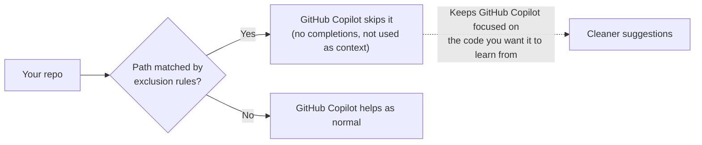

> Content exclusion is one of those features that turns "should we let GitHub Copilot into this repo?" into "yes — and here's exactly where it should focus." That single shift — from hesitation to confident adoption — is where the business value lives.
{: .prompt-tip }

**Who this is for:** the people who decide on and roll out GitHub Copilot — engineering leaders, platform owners, and security/compliance folks weighing the *why*, and the admins who actually configure it and need the *how*. The first half makes the business case; the second half is the practical setup. Skip to whichever half is yours.

## What it does, in one sentence

Content exclusion lets you tell GitHub Copilot: **"Focus on the code that matters, and leave these specific paths out of scope."** You define the paths — at the repository or organization level — and GitHub Copilot skips them for completions and as context.

That's a genuinely powerful lever. It means you don't have to choose between "GitHub Copilot everywhere" and "GitHub Copilot nowhere." You get to draw the lines.



The quiet benefit on that dashed line: by steering GitHub Copilot away from noise — generated files, vendored code, legacy configs — you actually get *better* suggestions, because the model is working from the code you'd want it to emulate.

## The business case: why this feature pays for itself

It's easy to file content exclusion under "security plumbing" and move on. But the real story is about **unblocking adoption** — and that's a number leaders care about.

Most GitHub Copilot rollouts don't stall on price or developer enthusiasm. They stall on a single question from security or legal: *"How do we guarantee it won't touch the wrong files?"* Without an answer, the pilot sits in committee for a quarter. Content exclusion **is** the answer — and every week it shaves off the approval cycle is a week your team is shipping faster with AI instead of arguing about it.

Think of the value in four concrete dimensions:

| Business benefit | What it looks like in practice |
|---|---|
| **Faster, broader adoption** | Security signs off because there's a documented control. GitHub Copilot goes from one pilot team to the whole org months sooner. |
| **Compliance & audit readiness** | A reviewable, version-controlled list of scoped-out paths is exactly the artifact auditors ask for. "Show me your AI data controls" has a one-file answer. |
| **Lower risk, lower friction** | Sensitive configs and regulated data are scoped out by policy, not by hoping every developer remembers. Risk drops without slowing anyone down. |
| **Better output = real productivity** | Steering GitHub Copilot away from generated and vendored noise means cleaner suggestions, fewer bad completions to reject, and more time saved per developer. |

The ROI math is simple: GitHub Copilot's productivity gains only count for the developers who are *actually allowed to use it*. Content exclusion is the lever that moves "allowed" from a cautious few to everyone — which is where the licensing investment finally pays back.

> The fastest way to waste a GitHub Copilot investment is to leave it stuck in security review. Content exclusion is the de-risking step that gets the whole org to "yes" — and ROI starts the day adoption widens.
{: .prompt-tip }

## The mental model: a focus tool, not just a filter

It's tempting to think of exclusion purely as a "keep stuff out" feature. The more useful framing is: **it tells GitHub Copilot where the good signal is.**

A repository is full of things you'd *love* GitHub Copilot to learn from (your well-factored service layer) and things you wouldn't (a 4,000-line generated client, a vendored library, an ancient config nobody wants copied). Exclusion lets you point GitHub Copilot at the former by scoping out the latter.

> Think of content exclusion as curation, not censorship. You're shaping the context GitHub Copilot draws from so its suggestions reflect the patterns *you* endorse.
{: .prompt-tip }

## Great candidates for exclusion

Here's where teams get real value:

| Exclude... | And you gain... |
|---|---|
| Generated code & build output | Suggestions based on hand-written patterns, not machine output |
| Vendored / third-party code | GitHub Copilot emulating *your* conventions, not a dependency's |
| Legacy config files that must stay in the repo | A clean way to scope them out while you modernize |
| Files under specific compliance constraints | A documented control you can show auditors |
| Checked-in data samples for tests | Test data stays out of completions and chat context |

The pattern: exclude the things that are *in* the repo for practical reasons but aren't the code you want GitHub Copilot to reason from.

## What pairs well with it

Content exclusion shines as part of a layered setup. It's the access-scoping piece — and it works best alongside:

- **Secret management** (vaults, environment variables, secret scanning) for credentials. Keep secrets out of the repo in the first place, and use exclusion as an extra layer for any config that legitimately has to live in-tree.
- **Repository permissions** for controlling who sees what.
- **Custom instructions and prompt files** for steering *how* GitHub Copilot behaves on the code it does see.

Together these give you a clean story: the right people, the right code, the right behavior.

## Rolling it out cleanly

A little discipline up front keeps the config healthy long-term:

```yaml
# Repository-level example — keep rules readable and commented
"*":
  # Comment WHY, not just WHAT — your future self will thank you.
  - "**/generated/**"          # codegen output, regenerated on build
  - "vendor/**"                # third-party code, not our conventions
  - "**/config/legacy/**"      # legacy configs, migration tracked in SEC-1421
  - "fixtures/customer-*.json" # sample data for integration tests
```

Four habits that keep it tidy:

1. **Comment every rule with a reason.** Six months on, "why is this excluded?" should be answerable from the file itself.
2. **Review it in PRs like any other code.** Exclusion config is governance-as-code — it deserves a reviewer.
3. **Re-check after big refactors.** Rules match paths, so a large reorg is a good moment to confirm they still point where you intend.
4. **Share the intent with your team.** When everyone knows *why* certain paths are scoped out, the config stays meaningful instead of mysterious.

## Set it up right the first time

A few details trip teams up on the way in — not because the feature is hard, but because it doesn't behave exactly like the tools people compare it to. Get these right and it "just works." (Everything here is straight from GitHub's official documentation.)

- **Check your plan.** Content exclusion is available with **Copilot Business** and **Copilot Enterprise**. If the setting isn't where you expect, the plan is the first thing to check.
- **Know who can edit what.** Repository admins, organization owners, and enterprise owners can manage the settings. The repo **"Maintain"** role can *view but not edit*. Enterprise-level rules apply to **all** GitHub Copilot users in the enterprise; organization-level rules apply only to users given a seat by that organization.
- **It's `fnmatch`, not `.gitignore`.** Patterns use [`fnmatch` notation](https://ruby-doc.org/core-2.5.1/File.html#method-c-fnmatch) and are **case-insensitive**. A leading `/` anchors to the repo root, `**` spans directories, and `{a,b}` / `[mk]` groups work — so don't assume gitignore semantics.
- **Reference repos correctly at org/enterprise scope.** You point at a repo by URL (`https://…`, `git@…`, `ssh://…`, or Azure DevOps host formats). GitHub Copilot matches regardless of how the repo was cloned, but a slightly wrong reference means the rule silently won't apply.
- **Give changes time to land.** After you edit rules, it can take **up to 30 minutes** to take effect in IDEs that already have the settings loaded. To apply them immediately: in VS Code run **Developer: Reload Window**; in JetBrains IDEs and Visual Studio, close and reopen the app. (Vim/Neovim fetch exclusions each time you open a file.)
- **Know which surfaces are covered.** Inline completions and Copilot Chat honor exclusions — but per GitHub's docs, **Copilot CLI, the Copilot coding (cloud) agent, and Agent mode in Copilot Chat do not support content exclusion**. Plan your sensitive-path strategy with that scope in mind rather than assuming a single blanket.
- **Verify it actually works.** GitHub recommends a quick test: open a non-excluded file and confirm you get an inline suggestion, then open an excluded file and confirm you *don't*. For Chat, attach the excluded file as context and ask `explain this file` — GitHub Copilot won't be able to use it, and it won't appear as a reference.

> The teams who love content exclusion are the ones who spent ten minutes upfront on these details. The pattern syntax, the propagation delay, and the covered surfaces are where first impressions are made.
{: .prompt-tip }

## The one-paragraph version for your team

> Content exclusion is how we get GitHub Copilot approved and rolled out org-wide with confidence. It scopes out the noise and the sensitive paths, gives us a documented control for compliance, and sharpens the suggestions developers actually see. We pair it with proper secret management and repo permissions, and we review the rules in PRs like any other code.

That's the framing that turns content exclusion from a checkbox into a genuine business win. It's the small piece of governance that unlocks the large return: a confident "yes" to GitHub Copilot, a faster path through security review, and the full productivity payoff landing across the whole org instead of one cautious corner of it.

---

*Found a clever way to use content exclusion to sharpen GitHub Copilot's suggestions on your team? I'd love to hear it — drop a comment below.*
