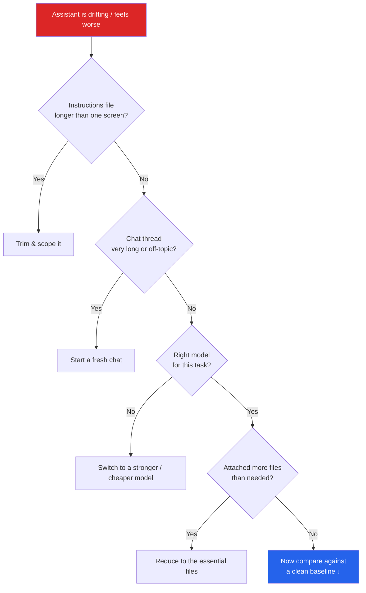

> "It forgot what we discussed five minutes ago." "It keeps ignoring our conventions." "It was great last month and now it's useless." If you've said any of these lately, this post is for you — and the fix is probably not the one you expect.
{: .prompt-tip }

There's a recurring story in 2026: an AI coding assistant that *used to feel sharp* now feels like it's drifting. The threads have memorable names — the "context trap," the model that's "heading for collapse." The frustration is real, and dismissing it does no one any favors.

But here's what I find almost every time I sit down to debug one of these complaints: **the model is fine. The context being fed to it is the problem.** Bloated instruction files, no scoping, runaway chat threads, the wrong model picked for the job, and thirty files attached "just in case." Garbage in, garbage out didn't stop being true because the input is now natural language.

This isn't a defense of any one tool — it applies equally to Copilot, Cursor, Claude Code, or whatever you're using. The model is only as good as the context window you hand it. Let's learn to keep that window clean.

## The symptom is not the cause

Most "it got worse" reports are describing a *symptom*. Underneath, the cause is almost always a context-hygiene problem. Here's the translation table:

| What you feel | What's usually really happening |
|---|---|
| "It forgot our conversation." | The context window evicted earlier turns — you're 40 messages deep in one chat. |
| "It ignores our coding style." | A 600-line instructions file diluted every rule until none carry weight. |
| "It used the wrong framework/pattern." | No scoping — test conventions are bleeding into UI code and vice versa. |
| "It's slower and dumber on big tasks." | Whole-repo context stuffing buried the signal in noise. |
| "It hallucinated a library that doesn't exist." | A cheap/fast model was used for a reasoning-heavy task. |

Notice none of these are "the model regressed." They're all about *what surrounds the model* at the moment you hit Enter.

## Think in terms of a context budget

Every request to an AI assistant has a finite **context window** — a token budget. Everything competes for that space: your system/custom instructions, the chat history, attached files, retrieved snippets, tool outputs, and finally your actual question.

The trap is intuitive but wrong: *more context feels safer*. In reality, every irrelevant token spends budget and dilutes the model's attention on what matters. A focused half-screen of context beats a sprawling dump every single time — the same way a clear 20-line function beats a 600-line one.

> Treat the context window like a function's parameters, not a junk drawer. You wouldn't pass 30 arguments to a function "just in case." Don't do it to your AI assistant either.
{: .prompt-warning }

## The five context-hygiene problems (and their fixes)

### 1. Instructions bloat

The single most common cause. A custom-instructions file that started lean grew into a 600-line style guide, and now *every* rule competes for attention — so none of them reliably win.

**The fix:** keep your always-on instructions to roughly one screen. Move anything that's only true for part of the codebase into scoped, path-specific instructions. (If you want the full breakdown of how to structure this, see my earlier post on [Copilot customization that actually sticks](/posts/github-copilot-customization-that-actually-sticks/).)

### 2. No scoping

When all your guidance is global, the model applies test conventions to UI files and API patterns to scripts. You experience this as "it used the wrong pattern," but you never told it *where* each pattern applies.

**The fix:** scope rules to the files they govern. Path-specific instruction files (matched by a glob) only load when the assistant touches matching files — so your front-end work stops getting polluted by back-end rules.

### 3. Runaway chat threads

Long-lived chats are deceptively expensive. By message 40, the earliest (often most important) turns have been pushed out of the window, and the model is reasoning over a half-remembered conversation. This is the real source of "it forgot what we agreed on."

**The fix:** start a fresh chat per task. When a thread gets long or changes topic, summarize the decisions that matter into a short prompt and begin again. Shorter, focused threads consistently outperform one marathon conversation.

> A good heuristic: if you've changed *what you're working on*, change *the chat*. Topic switch = new thread.
{: .prompt-tip }

### 4. Wrong model for the task

Fast, cheap models are excellent for autocomplete and simple edits — and frustrating for architecture, multi-file refactors, or tricky debugging. Use one for the other and you'll see shallow reasoning and the occasional confidently-wrong (hallucinated) answer.

**The fix:** match the model to the job. Reach for a higher-capability model when the task needs real reasoning or spans many files; drop back to a fast model for routine work. The mismatch — not the model itself — is usually what "feels dumb."

### 5. Context stuffing

Attaching the whole repo, or 30 files "to be safe," feels thorough. It does the opposite: it lowers the signal-to-noise ratio, and the relevant lines get lost among thousands of irrelevant ones.

**The fix:** attach the *fewest* files that contain the answer. Point the assistant at the two or three files that matter. If you genuinely don't know where the relevant code is, ask it to search first, then work — rather than pre-loading everything.

## A 30-second triage flow

Before you conclude the model is broken, run this:

Each branch you fix removes a likely cause. Most of the time you never reach the bottom — one of the first three boxes was the culprit.

## The "is it me or the model?" two-minute test

When you genuinely can't tell, isolate the variable:

1. Open a **brand-new chat**.
2. Add **only** the one or two files that matter.
3. Ask the **single, specific** thing you want.

If it nails the task with clean context, then the model was never the problem — your context was. If it *still* fails on a minimal, well-scoped request, now you have a real signal worth reporting (and a tidy reproduction to share).

This test is also the fastest way to escape the blame spiral. Instead of "the AI is useless lately," you get a concrete answer: *it was the 40-message thread*, or *it was the bloated instructions file*, or — occasionally — *yes, this is a genuine model limitation.*

## The takeaway

The assistants did not quietly get worse. As our projects, chats, and instruction files grew, **we got noisier** — and the model faithfully reflected the noise back at us.

The teams who say they "fixed" their AI assistant mostly just cleaned their context: a lean instructions file, scoped rules, short focused chats, the right model, and the minimum set of files. Context engineering is the new prompt engineering. Keep the window clean, and the "collapse" tends to disappear.

---

*Have a context-hygiene habit that turned your AI assistant around? I'd love to hear it — drop a comment below.*
