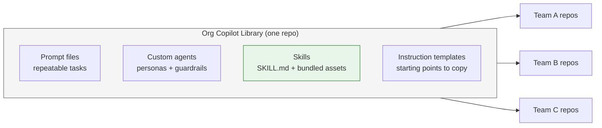
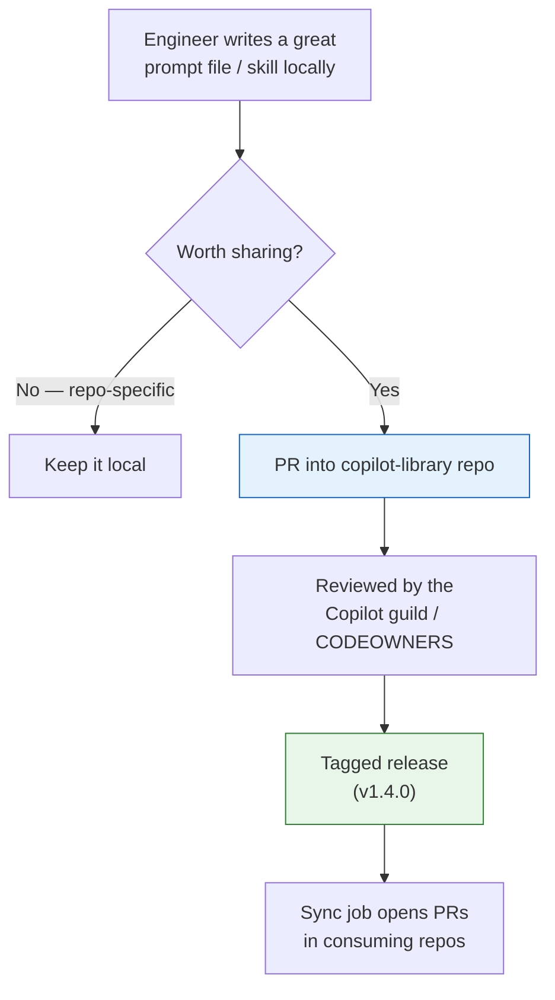

> If you've already read [the customization field guide](), you know *which* lever to pull for which problem. This post is the next question every platform team eventually hits: **how do we stop each team from reinventing those levers, and share them instead?**
{: .prompt-tip }

Here's a pattern I see in every org that adopts Copilot seriously. Month one: someone on the payments team writes a brilliant prompt file for scaffolding endpoints. Month two: the orders team writes their own — slightly worse, subtly different. Month three: there are five versions of "generate a PR description," none of them the good one, and nobody knows which is canonical.

This is the same problem we already solved for *code* a decade ago. We don't copy-paste utility functions between repos; we publish a shared package. Copilot customizations — prompt files, agents, skills, instruction templates — deserve the exact same treatment. They are assets. They drift, they rot, and they benefit enormously from a single source of truth.

This post is about building that source of truth: **a reusable Copilot library for your org.**

## What actually goes in the library

A "Copilot library" isn't one file type — it's a curated collection of the reusable layers. Always-on repository instructions usually stay local to each repo (they're repo-specific by nature), but everything *invocable* or *reusable* is a candidate for sharing:



The four things worth centralizing:

- **Prompt files** — the cross-cutting chores every team does: "draft a PR description," "write a conventional commit," "generate a test file," "summarize this incident." These are nearly identical everywhere, so they're the highest-value thing to standardize first.
- **Custom agents** — a vetted "Reviewer" agent (read-only, safe to hand anyone), a "Migration" agent, a "Docs" agent. Building a *good* agent with the right guardrails is real work; do it once.
- **Skills** — packaged know-how the model pulls in *by itself*. These are the crown jewels of a shared library because they carry **bundled assets** (scripts, templates, reference specs) that a copy-pasted snippet never could.
- **Instruction templates** — not the final `copilot-instructions.md` (that's repo-specific), but a *starter* with the structure filled in and `<TODO>` placeholders, so a new repo starts from the org's best shape instead of a blank file.

> Don't try to centralize repository instructions themselves. Each repo's stack and rules differ — forcing one file org-wide recreates the "everything in one file" mistake at company scale. Share the *template*, not the contents.
{: .prompt-warning }

## Where it lives and how teams get it

You have three realistic distribution models. Pick based on how much consistency you need versus how much autonomy teams want.

| Model | How it works | Best when |
|---|---|---|
| **Org / enterprise custom instructions** | Set in *Organization settings → Copilot → Custom instructions* (not in a repo). Applies across the org to Copilot Chat, code review, and the cloud agent on GitHub.com — no per-repo file needed — but it's **natural-language text only**. | You want a shared baseline of *rules*. It can't carry prompt files, agents, or skills. |
| **Central library repo + copy-in** | One `copilot-library` repo holds everything; a small CI job (or a CLI) copies the relevant files into consuming repos and opens a PR on update. | You want versioning and review, and teams to opt into what they pull. |
| **Git submodule / subtree** | Consuming repos mount the library as a submodule under `.github/`. | Teams are comfortable with submodules and want exact pinning. |

> Org custom instructions require a **Copilot Business or Enterprise** plan and are configured by an org owner. They currently apply to **Copilot Chat, Copilot code review, and the Copilot cloud agent on GitHub.com** — not to your IDE — so treat them as a GitHub.com baseline, not a replacement for repo-level instruction files. ([docs](https://docs.github.com/en/copilot/how-tos/configure-custom-instructions/add-organization-instructions))
{: .prompt-tip }

> A common myth is that dropping files in your org's special `.github` repository pushes them to every repo. It doesn't. That repo only supplies *fallback* community-health files — `CONTRIBUTING.md`, `CODE_OF_CONDUCT.md`, `SECURITY.md`, issue/PR templates — to repos that lack their own, and only when the `.github` repo is **public**. It does **not** distribute `copilot-instructions.md`, prompt files, agents, or skills. The only "everywhere, no opt-in" lever is org-level custom instructions in settings, and those are text-only. ([docs](https://docs.github.com/en/communities/setting-up-your-project-for-healthy-contributions/creating-a-default-community-health-file))
{: .prompt-warning }

For most orgs the **central library repo + copy-in** model wins for the *invocable* assets (prompts, agents, skills), often paired with **org custom instructions** for the always-on baseline rules. It treats customizations like a dependency: versioned, reviewed, and updated through a PR you can actually see — not magic that changes behavior under everyone's feet.



## Give it a structure people can navigate

A library nobody can find is just a folder. Decide on a layout and a naming convention *before* it grows past ten files. Something like:

```text
copilot-library/
├── README.md                      # the catalog — what exists, what each is for
├── prompts/
│   ├── pr-description.prompt.md
│   ├── conventional-commit.prompt.md
│   └── incident-summary.prompt.md
├── agents/
│   ├── reviewer.agent.md
│   └── migration.agent.md
├── skills/
│   ├── release-notes/
│   │   ├── SKILL.md
│   │   ├── scripts/collect-prs.sh
│   │   └── templates/release-notes.md
│   └── threat-model/
│       └── SKILL.md
└── templates/
    └── copilot-instructions.template.md
```

Two rules keep this usable:

- **Names are an API.** `pr-description.prompt.md` tells you what it does at a glance. `helper2.prompt.md` does not. Treat the filename like a public function name.
- **The README is the catalog.** A one-line description per asset, grouped by type. This is the page a new hire reads to discover what's available. If it's stale, the library is dead.

## The promotion pipeline: personal → team → org

Not every prompt file deserves to be org-wide. The best libraries have a **graduation path**, so quality rises as scope widens:

1. **Personal** — you keep it in your own dotfiles / user profile. Zero ceremony. Most ideas live and die here, and that's fine.
2. **Team** — it's proven useful for *you*, so it moves into the team repo where a few people benefit. Light review.
3. **Org** — it's been battle-tested by a team and is genuinely cross-cutting. It earns a PR into the central library, a real review, and a version tag.

Make the criteria for the org tier explicit, because "everyone adds whatever" is how the catalog turns to noise:

> A customization graduates to the org library when it is (a) **generic** — not tied to one team's stack, (b) **proven** — used regularly by at least one team, and (c) **owned** — someone's name is on it. Generic, proven, owned. If it fails any of the three, it stays at team level.
{: .prompt-tip }

## Treat it like code, because it is

Everything that makes a code library trustworthy applies here:

- **Version it.** Tag releases (`v1.4.0`). When the "PR description" prompt changes, consumers see a diff and a changelog, not silent drift.
- **Review it.** Put `CODEOWNERS` on the library repo. A prompt file that tells the AI to skip tests is exactly as dangerous as code that does — it deserves the same gate.
- **Test the skills.** Skills can ship scripts. A script is code; lint it, and ideally have a CI check that the `SKILL.md` frontmatter is valid and the bundled paths resolve.
- **Write descriptions like triggers, not titles.** This matters *more* in a shared library than locally. A skill only fires when its `description` matches the task — and across an org with dozens of skills, vague descriptions mean the wrong skill fires or none does. "Helps with docs" is useless; "Use when drafting customer-facing release notes or a changelog from merged PRs" is a precise trigger.

## Who owns it: the Copilot guild

A shared library with no owner becomes a junk drawer. You don't need a big team — you need *named accountability*. The pattern that works is a lightweight **guild**: a handful of engineers from different teams who own the library repo, review contributions, and curate the catalog. Rotate membership so it doesn't become one person's burden.

Their job is small but crucial: keep the catalog honest, reject duplicates, merge the good stuff, and retire what's gone stale. Think of them as librarians, not gatekeepers — the goal is *more* good reuse, not control for its own sake.

## Close the loop: measure reuse

A library is only worth maintaining if people use it. Track the cheap signals:

- **Adoption** — how many repos have synced the library? A sync job makes this trivial to count.
- **Reuse** — which prompt files and skills get invoked? If three assets do all the work and twenty are dead weight, prune the twenty.
- **Contribution** — are new things graduating in, or is the library frozen? A healthy library has a slow but steady inflow.

You don't need a dashboard on day one. You need to *ask the question* every quarter: is this saving more time than it costs to maintain? If yes, invest more. If no, shrink it to the assets that earn their place.

## Start here (a one-week plan)

You don't build the whole machine at once. Order of return-on-effort:

1. **Day 1:** create the `copilot-library` repo with a README and three folders. Move *one* genuinely cross-cutting prompt file in — "PR description" is the classic first pick.
2. **Day 2:** add a `CODEOWNERS` and name two or three people as the founding guild. Accountability before volume.
3. **This week:** package one piece of real know-how as a skill with a bundled script or template — the thing copy-paste could never carry. That's your proof the library does something a wiki can't.
4. **Next sprint:** wire up the simplest possible sync — even a documented "copy these files and open a PR" step beats nothing. Automate it once two teams are pulling.
5. **Ongoing:** review the catalog quarterly. Promote what's proven, retire what's dead.

The payoff compounds the same way a good internal package does. The first shared prompt file saves one team a little time. The fiftieth — discovered, trusted, and pulled in automatically — is how an entire org stops reinventing the same wheel and starts building on each other's best work.

---

*Building a shared Copilot library at your org? I'd love to hear what made the catalog versus what stayed local — drop a comment below.*
