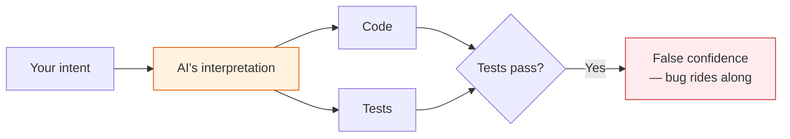
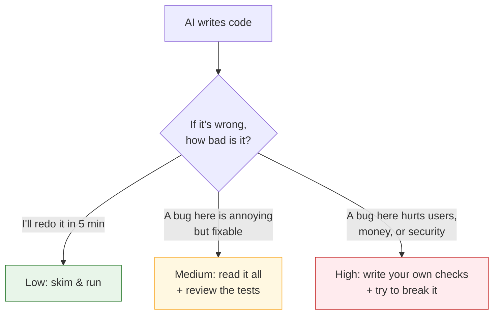
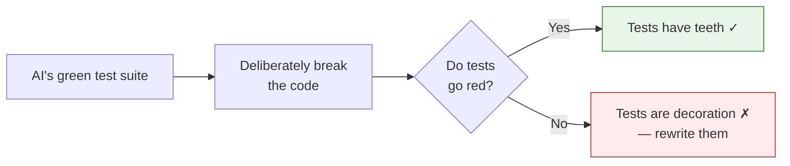

> The most dangerous phrase in AI-assisted development is "the tests pass." Not because it's false — but because nobody checked whether the *tests* are any good. If the model wrote the code and the tests and graded its own homework, "passing" tells you almost nothing.
{: .prompt-warning }

AI coding assistants are genuinely great at producing code that *looks* right. That's exactly the problem. Plausible-looking code that compiles and runs is the hardest kind to review, because your brain pattern-matches it as "fine" and moves on. The bug isn't in the code you'd scrutinize — it's in the line you skimmed because it looked normal.

So the question isn't *whether* to use AI to write code. It's how to **verify** what it produces without slowing down to the point where the AI stopped saving you time. This post is a strategy for exactly that — and like the rest of this series, it's tool-neutral. It applies whether you're using Copilot, Cursor, Claude Code, or anything else that writes code on your behalf.

## The core trap: the tool that writes shouldn't certify

When you ask an assistant to "write this function and add tests," you get a tidy bundle: implementation plus a green test file. It feels complete. But look at what actually happened — **the same model encoded its understanding of the problem into both the code and the tests.** If its understanding was wrong, the tests don't catch the bug. They *enshrine* it.

Notice where everything narrows: both the code *and* the tests flow from a single interpretation. A misunderstanding there is a single point of failure that no amount of green checkmarks will reveal. Verification has to inject an **independent source of truth** — something that didn't come from that same interpretation. Usually, that something is *you*.

## Match your scrutiny to the blast radius

Here's a trap worth naming early: treating all AI-written code as equally risky. If you read every line of a throwaway script as carefully as you'd read your payment logic, you'll burn the time the AI just saved you. If you skim your payment logic as casually as a throwaway script, you'll ship a very expensive bug. The skill is **spending your verification effort where the damage would actually land.**

So before you verify anything, ask one question: **if this code is wrong, how bad is it — and how far does the damage spread?** That's the "blast radius." Your answer puts the code in one of three buckets, each with a different amount of checking.

The same prompt — *"write me a function"* — earns wildly different verification depending on what the function touches:

| The code | If it's wrong... | How hard you check |
|---|---|---|
| A script to rename 200 local files | You rerun it. Done. | **Low** — skim it, run it, move on. Reading every line is over-investment. |
| A function that formats dates in the UI | A date looks weird; someone files a ticket. | **Medium** — read every line, and read the tests like you'd review a junior's PR (because that's what it is). |
| A function that charges a customer's card | You overcharge real people and refund in a panic. | **High** — *you* write the assertions from the business rules ("a $0 order charges nothing"), don't trust the AI's own tests for the critical path, and actively try to break it. |

The point isn't the exact three buckets — it's the **habit of asking the blast-radius question before you trust anything.** Most of the time you'll land in the middle. But the moment the answer is "this touches auth, money, personal data, or a contract other teams depend on," your trust should drop and your verification should climb.

> The model sounds *exactly* as confident writing your billing logic as it does writing a throwaway script. It can't tell the difference and won't warn you. That judgment — how much to distrust this particular piece of code — is yours alone to supply.
{: .prompt-tip }

## Review the tests harder than the code

This is the counterintuitive heart of the strategy. When code and tests arrive together, your attention should go to the **tests first**, because a weak test suite is what lets a subtle bug survive. Ask of every AI-generated test:

- **Does it actually assert behavior, or just that the code ran?** A test that calls the function and checks it "doesn't throw" is theater. Look for assertions on real return values and side effects.
- **Are the edge cases the ones that matter, or the ones that were easy?** AI loves testing `null` and empty string. It far less often tests the off-by-one boundary, the concurrent call, the timezone at midnight, the empty-but-not-null case that breaks your specific logic.
- **Is it testing the requirement, or the implementation?** A test written *from the code* will happily assert the buggy behavior the code already has. A good test encodes what the function *should* do — which means it has to come from outside the code.
- **Would it fail if the code were wrong?** The fastest check: break the implementation on purpose and confirm the test goes red. A test that stays green when you sabotage the code is worse than no test — it's a false alarm that will never ring.

That last one deserves its own name.

## The mutation check: a 30-second trust test

Before you believe a green suite, **sabotage the code and watch the tests fail.** Flip a `>` to a `>=`. Return `null` instead of the result. Comment out the validation. Then run the tests.

If the tests don't notice that you broke the thing they're supposed to protect, they were never protecting it. This is a manual, lightweight version of mutation testing, and it takes under a minute. It's the single highest-leverage habit for working with AI-written tests, because it directly attacks the "tests pass means nothing" problem.

## Flip the order: tests first, then let AI implement

The cleanest way to break the "same interpretation writes both" trap is to **not let the same interpretation write both.** Write the test first — from the requirement, in your own words — and *then* ask the assistant to make it pass.

Now the roles are right: *you* own the specification (the test), and the AI owns the labor (the implementation). The test becomes the independent source of truth the model has to satisfy, rather than a mirror it gets to draw itself. You don't have to do this for everything, but for Rung 3 code it's the difference between hoping it's correct and *defining* correct.

> Even a lightweight version helps: before accepting a suggestion, write down the two or three assertions that *must* be true. If you can't, you don't understand the requirement well enough to verify any code for it — AI-written or not.
{: .prompt-tip }

## Use AI to attack its own code

Verification isn't only manual. The same assistant that wrote the code is surprisingly good at *finding* problems with it — as long as you ask in a separate, adversarial pass instead of letting it cheerlead its own work. Some prompts that pull real value:

- *"What edge cases does this code not handle? List them, don't fix them yet."*
- *"Write tests that would make this function fail. Try to break it."*
- *"What assumptions does this code make about its inputs that aren't validated?"*
- *"Review this as a security engineer looking for the worst-case input."*

The trick is the **framing flip**. When you ask "write this," the model optimizes for plausible and complete. When you ask "break this," it optimizes for failure modes. Same tool, opposite incentive — and the second pass routinely surfaces the case the first pass quietly ignored. A read-only "reviewer" agent (no edit access) is a natural home for this, so the critic can't quietly patch over what it finds.

## What this looks like as a habit

You don't need a heavyweight process. The whole strategy collapses into a short loop you run on every meaningful chunk of AI-written code:

1. **Classify the blast radius.** Throwaway, recoverable, or critical? That sets the rung.
2. **Read the tests before the code.** Assertions real? Edge cases the hard ones? Requirement, not implementation?
3. **Run the mutation check.** Break the code on purpose; confirm red.
4. **For critical paths, own the assertions yourself** — ideally test-first.
5. **Do one adversarial AI pass** — "break this," not "build this."

It adds minutes, not hours. And it buys back the thing AI-assisted coding quietly erodes: the justified confidence that what shipped actually does what you meant.

## The takeaway

"The tests pass" is the beginning of verification, not the end of it. AI can write the code and write the tests, but it cannot supply the one ingredient that makes testing meaningful — an *independent* understanding of what correct looks like. That part is still your job, and it's the part that makes you valuable in a world where typing the code is free.

Trust the AI to do the work. Verify like it didn't.

---

*This pairs naturally with keeping your context clean — see [Copilot Isn't Getting Worse — Your Context Is](). Got a verification habit that's saved you from an AI-written bug? Drop it in the comments.*
