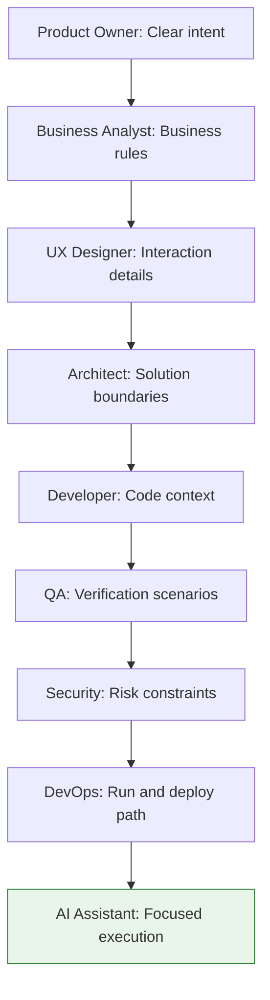

> The cheapest AI-generated code is not the code produced by the cheapest model. It is the code produced from the clearest intent, the smallest useful context, and the fewest rework loops.
{: .prompt-tip }

We talk about token optimization like it is a developer habit: use less context, pick the right model, avoid giant prompts, keep agent tasks scoped.

All true.

But it misses the bigger point.

In AI-assisted software delivery, token waste usually starts **before** the developer opens the editor.

A vague user story burns tokens.  
An unclear architecture decision burns tokens.  
Missing business rules burn tokens.  
Weak test scenarios burn tokens.  
Late security feedback burns tokens.  
Undocumented deployment steps burn tokens.

The coding assistant gets blamed at the end, but the waste was often introduced upstream.

This is the uncomfortable truth of the token era:

**Token optimization is not just prompt engineering. It is team discipline.**

## The new cost of ambiguity

In traditional software delivery, poor inputs caused delays, rework, defects, and frustration.

In AI-assisted delivery, poor inputs cause all of that — plus measurable token consumption.

Every unclear requirement becomes a clarification loop.  
Every missing edge case becomes a debugging loop.  
Every unknown pattern becomes a repository exploration loop.  
Every late review comment becomes a refactoring loop.

This isn't just a minor line item on a bill. It is a **Rework Multiplier**.

| Input Quality | Inference Turns | Token Multiplier | Human Time Cost |
|---|---|---|---|
| **High Clarity** | 1-2 | 1.0x | 0 min |
| **Vague/Ambiguous** | 5-8+ | 4.0x - 10.0x | 45-60 min debugging |

### Understanding the cost
*   **Inference Turns:** How many times the developer has to "talk back" to the AI to correct its mistakes.
*   **Token Multiplier:** The cumulative cost. Chat history grows with every turn; by turn 8, you are paying for the 7 previous failures every time you hit Enter.
*   **Human Time Cost:** The time a developer spends "babysitting" a confused AI instead of shipping code.

The bill shows up as tokens, but the real cost is the 4x increase in delivery time. 

**This is the hidden tax of ambiguity:**  
The **Product Owner** provides a fuzzy story, the **Architect** leaves a design undecided, and the **Developer** is left to "pay the bill" by spending hours—and thousands of tokens—trying to guess the intent. We are telling **Team Leads** that token optimization isn't a coding trick; it's a requirement for the people writing the stories.

## The AI did not remove roles. It raised the bar for them.

There is a tempting but dangerous belief that AI can compensate for weak upstream work.

> "Just give it the story. It will figure it out."

Sometimes it will. Often it will not. And even when it does, it may spend a lot of tokens wandering through possibilities your team could have ruled out in one sentence.

AI is excellent at execution.  
It is not a replacement for intent.

But here is the shift most teams miss: **AI is not only for the coding step.** 

Every persona can — and should — point it at *their own* work to accelerate the "Token-Ready Brief." The Architect doesn't just write a design; they use AI to attack it: *"Where is this underspecified? Where could it be built three different ways?"* The PO doesn't just guess acceptance criteria; they ask AI, *"What would you have to assume to build this?"*

The goal is to surface the gaps, contradictions, and unstated assumptions before they flow downstream. The coder is simply the last person to use AI, not the first.

The better each persona does their job, the better the AI performs its job.



In the token era, every role becomes part of the cost-control system.

## Product Owners: write requirements that reduce guessing

The Product Owner's job becomes more important, not less.

A coding assistant can generate flows, APIs, tests, and UI changes quickly. But if the requirement is vague, it will optimize for something that merely sounds plausible.

Poor requirement:

```text
Improve notifications.
```

Token-efficient requirement:

```text
As an invoice approver, I want an email notification when an invoice moves from Pending to Approved so that I can track completed approvals.

Acceptance criteria:
- Send email only when status changes from Pending to Approved.
- Do not send email for Draft, Rejected, or Approved-to-Approved transitions.
- Use the existing notification template.
- If email sending fails, invoice approval must still succeed.
- Out of scope: SMS, push notifications, and new notification preferences.
```

That second version does not just improve delivery quality. It saves tokens.

The AI does not have to infer the trigger, the exception cases, the template behavior, or the out-of-scope boundaries.

A strong Product Owner should provide:

| Input | Why it matters for token efficiency |
|---|---|
| Business goal | Prevents solving the wrong problem |
| User persona | Clarifies who the experience is for |
| Acceptance criteria | Gives the AI a completion target |
| Out-of-scope items | Prevents unnecessary implementation |
| Examples | Reduces interpretation errors |
| Priority | Helps choose the minimal viable change |

The more precise the story, the fewer turns the team spends asking, correcting, and reworking.

And you don't have to catch the gaps alone. Paste the draft story into an AI and ask *what would you have to assume to build this?* — its assumptions are your missing acceptance criteria, surfaced before they ever reach a developer.

## Business Analysts: turn hidden rules into executable clarity

Many token-heavy AI sessions happen because a business rule was never written down. "Notify users when invoices are approved" hides real logic that the assistant will otherwise have to *guess* — and then get corrected on:

| Current status | New status | Send email? |
|---|---:|---:|
| Draft | Approved | No |
| Pending | Approved | Yes |
| Approved | Approved | No |
| Pending | Rejected | No |
| Rejected | Approved | No |

That table is gold. It converts fuzzy domain knowledge into something the AI can implement and test in one pass, instead of discovering the rules through failed rework loops.

Let AI help you build it: ask it to list every state transition your rules *don't* yet cover. The empty cells it finds are exactly where rework hides.

## Architects: reduce solution uncertainty

Architectural ambiguity is expensive.

If the AI is not told where a behavior belongs, it may put logic in the controller, service, event handler, repository, background worker, or all of the above if it is feeling particularly "helpful."

Weak architecture direction:

```text
Implement this in the backend.
```

Token-efficient architecture direction:

```text
Use the existing domain event pattern.
Emit InvoiceApprovedEvent from InvoiceService after a valid status transition.
Handle email notification in NotificationEventHandler.
Do not call EmailService from the controller.
Do not introduce a new queue.
Follow the existing OrderApprovedEvent implementation.
```

That small paragraph can save an enormous amount of exploration.

The architect should define:

| Area | Example guidance |
|---|---|
| Pattern | Use domain events, not controller logic |
| Boundaries | Do not modify persistence schema |
| Integration | Use existing EmailService |
| Reuse | Follow OrderApprovedEvent pattern |
| Non-functional needs | Failure must not block approval |
| Constraints | No new infrastructure for this story |

Good architecture guidance narrows the search space.

And narrowing the search space is one of the best ways to reduce token usage.

Before you circulate the design, have AI attack it: *where is this underspecified? Where could it be built three different ways?* Every ambiguity you resolve now is a branch of exploration the team never pays to walk down later.

## Developers: become context curators

In AI-assisted development, developers do not stop being developers — they become the people who know *which* context matters. Compare:

```text
Implement invoice approval notification.
```

against:

```text
Implement invoice approval notification using the existing pattern in OrderApprovedEventHandler.

Relevant files:
- InvoiceService
- NotificationEventHandler
- EmailService
- InvoiceServiceTests

Constraints:
- Do not modify controller behavior.
- Do not introduce new infrastructure.
- Add focused unit tests only.
```

The second prompt hands the assistant boundaries instead of a search problem. The developer's high-value work shifts from typing code to curating context: naming the right files, pointing at the pattern to copy, stating constraints, and reviewing small diffs. Less typist, more implementation guide — and a much cheaper one.

A quick self-check: ask the assistant which files it thinks it needs *before* it edits. If the list surprises you, your context was incomplete — fix that, not the output.

### The Developer's "Final Mile"

Even with a perfect brief, the developer is the final gatekeeper of the token budget. Upstream clarity provides the map, but you still have to drive efficiently. Once the ambiguity is rectified, you must apply precision habits:

| Technical Habit | Token Impact |
|---|---|
| **Right model for the task** | Use smaller, faster models for boilerplate and refactoring. Save large reasoning models for complex logic and structural changes. |
| **Aggressive context pruning** | Don't just "Add All Files." Use only the specific files identified in your brief to minimize noise and distractions. |
| **Small, stable increments** | Ask for one clear change at once. Large, multi-file requests lead to more errors and expensive rework turns. |
| **Clean the slate** | Clear your chat history between unrelated tasks. Don't force the AI to keep paying for old context it no longer needs. |

## Readiness roles: prove the brief before code

Once the story, rules, architecture, and code context are clear, the question changes.

It is no longer just: **can AI build this?**

It becomes: **will the result be correct, secure, usable, and runnable?**

That is where QA, Security, DevOps, and UX protect the token budget. They are not cleanup crews at the end of the sprint. They are readiness gates before the agent starts building.

QA defines what correctness means. If the AI writes both the implementation and the tests from the same vague story, it may simply encode the same misunderstanding twice. That is how teams get green tests and wrong behavior.

Weak QA input:

```text
Test invoice approval.
```

Token-efficient QA input:

```text
Test scenarios:
1. Pending -> Approved sends one email.
2. Draft -> Approved does not send email.
3. Approved -> Approved does not send duplicate email.
4. Pending -> Rejected does not send email.
5. Email failure logs a warning but approval still succeeds.
6. Missing approver email skips notification and logs the reason.
```

QA can use AI here too — not to blindly invent tests, but to challenge the test plan: *what scenarios am I missing? what edge case would break this?* The human still decides what matters. The AI helps expose the gaps earlier.

The same idea applies to the other readiness roles. We move them from "cleanup" to "constraints":

### Security: define the vault, not the patch
**Weak Input:** "Make it secure."  
**Token-Efficient Input:** "Only users with the `FinanceApprover` role can trigger this. Do not log the `InvoiceBody`. Sanitize all inputs against SQL injection using the existing `SecurityMiddleware`."

### DevOps: define the path, not the search
**Weak Input:** "Deploy this."  
**Token-Efficient Input:** "Deploy as a Dockerized Node.js app to Azure App Service using the `finance-prod-spec` GitHub Action. Use Vault for secrets; do not invent environment variables."

### UX: define the state, not the look
**Weak Input:** "Add a success message."  
**Token-Efficient Input:** "Show a `ToastNotification` on success. If email fails, show a `WarningBanner` with the message 'Invoice approved, but notification failed'. Use the system primary purple for the button state."

This is the point of the back half of the SDLC: not more documentation for its own sake, but fewer late surprises. Every readiness gap left unstated becomes a future prompt, a future correction, and a future token bill.

## The token-ready story brief: A team-wide readiness check

The "Brief" is a team agreement. Before the developer starts coding, the **Product Owner, Architect, and Developer** must spend a few minutes aligning on the boundaries. 

> **The 15-Minute Clarity Rule:** If your team cannot agree on the Acceptance Criteria and Architecture for a story in under 15 minutes, **stop the work.** This is a signal that the story is too large and will waste significant tokens. The team should split it into two smaller, clearer tasks immediately.
{: .prompt-info }

Here is how a single story transforms from a "guessing game" into an "execution plan."

### Before

```text
Add invoice approval notifications.
```

This sounds simple. But it leaves unanswered questions:

- Who gets notified?
- When exactly?
- Email, SMS, push, or in-app?
- What status transition counts as approval?
- What if notification fails?
- What template should be used?
- Where should the logic live?
- What tests prove correctness?
- Are there security constraints?
- Is this behind a feature flag?

Each unanswered question becomes token spend.

### After

```text
Story title:
Invoice approval email notification

Business goal:
Notify finance users when an invoice is approved.

User persona:
Finance approver

Acceptance criteria:
- Send email only when invoice status changes from Pending to Approved.
- Use existing EmailService and approval notification template.
- Do not block invoice approval if email sending fails.
- Log notification failure with invoice ID only.

Business rules:
- Draft -> Approved: no email
- Pending -> Approved: send email
- Approved -> Approved: no duplicate email
- Pending -> Rejected: no email

Out of scope:
- SMS notifications
- Push notifications
- New email templates
- Notification preference center
- Database schema changes

Architecture:
- Use existing domain event pattern.
- Emit InvoiceApprovedEvent from InvoiceService.
- Handle email in NotificationEventHandler.
- Follow OrderApprovedEvent pattern.

Testing:
- Pending -> Approved sends email.
- Invalid transitions do not send email.
- Duplicate approval does not send duplicate email.
- Email failure logs warning and approval succeeds.

Security:
- Do not include bank details in email.
- Log invoice ID only.

Operations:
- Feature flag: invoiceApprovalNotification
- No migration required.

Definition of done:
- Unit tests pass.
- Existing approval behavior unchanged.
- Notification failure does not block approval.
```

This version lets the AI execute. The first version makes the AI investigate.

That is the difference between productive token usage and token waste. The brief is not extra paperwork — it is the place where every role's contribution lands before it becomes an expensive question mid-build.

## A role-by-role token checklist

Before sending a story into AI-assisted implementation, ask:

| Role | Token-saving question |
|---|---|
| Product Owner | Is the user need and acceptance criteria clear? |
| Business Analyst | Are the business rules and exceptions explicit? |
| UX Designer | Are states, copy, and accessibility expectations defined? |
| Architect | Is the solution direction and boundary clear? |
| Developer | Are relevant files and existing patterns identified? |
| QA | Are verification scenarios listed? |
| Security | Are access, data, logging, and compliance constraints known? |
| DevOps | Are run, test, config, and deployment paths documented? |

If the answer is "no" for several rows, the team is not ready for efficient AI implementation.

The assistant can still start coding.

It will just spend more tokens discovering what the team should already know.

## The cultural shift

The old mindset was:

> "AI will figure it out."

The better mindset is:

> "We will give AI precise intent, bounded context, and strong verification."

That is the cultural shift.

AI does not remove the need for good Product Owners, Architects, Developers, Testers, Security Engineers, or Platform teams.

It amplifies the quality of their inputs.

Good inputs produce focused AI work.  
Bad inputs produce confident AI wandering.

And confident wandering is expensive.

## The takeaway

Token optimization is not only about shorter prompts.

It is about better software delivery.

When Product Owners write clearer stories, Architects define sharper boundaries, Developers provide focused context, QA supplies real scenarios, Security shifts left, and DevOps documents the path to run and deploy, AI becomes dramatically more effective.

Fewer prompts.  
Fewer wrong turns.  
Fewer retries.  
Better code.  
Lower cost.

The teams that win with AI will not be the teams that ask the cleverest prompts.

They will be the teams that make every role sharper.

Because in the token era, clarity is not just a virtue.

It is a cost-control strategy.

---

*How does your team prepare stories for AI-assisted development? Do you already have a “token-ready” checklist, or are you still letting agents discover requirements the hard way?*
