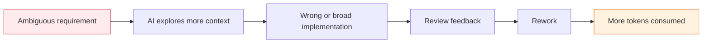

> The cheapest AI-generated code is not the code produced by the cheapest model. It is the code produced from the clearest intent, the smallest useful context, and the fewest rework loops.
{: .prompt-tip }

We talk about token optimization like it is a developer habit: use less context, pick the right model, avoid giant prompts, keep agent tasks scoped.

All true.

But it misses the bigger point.

In AI-assisted software delivery, token waste usually starts **before** the developer opens the editor.

A vague user story burns tokens.  
An unclear architecture decision burns tokens.  
Missing business rules burn tokens.  
Weak test scenarios burn tokens.  
Late security feedback burns tokens.  
Undocumented deployment steps burn tokens.

The coding assistant gets blamed at the end, but the waste was often introduced upstream.

This is the uncomfortable truth of the token era:

**Token optimization is not just prompt engineering. It is team discipline.**

## The new cost of ambiguity

In traditional software delivery, poor inputs caused delays, rework, defects, and frustration.

In AI-assisted delivery, poor inputs cause all of that — plus measurable token consumption.

Every unclear requirement becomes a clarification loop.  
Every missing edge case becomes a debugging loop.  
Every unknown pattern becomes a repository exploration loop.  
Every late review comment becomes a refactoring loop.

The bill shows up as tokens, but the root cause is usually ambiguity.



A useful mental model:

$$
\text{Tokens} \approx \text{Context Discovery} + \text{Implementation} + \text{Rework loops}
$$

Ambiguity does not sit neatly in one term. It acts as a *multiplier* on all of them: a vague story makes the assistant read more context, implement more speculatively, and loop through more rework.

The difference is not hypothetical. Take a single "add invoice approval notification" story:

| Cost driver | Vague story | Token-ready brief |
|---|---:|---:|
| Context discovery | ~40K (agent explores unknown patterns) | ~10K (points at the right files) |
| Implementation | ~15K (broad, speculative) | ~10K (scoped change) |
| Rework loops | ~65K (3–4 correction rounds) | ~15K (1 round) |
| **Total** | **~120K** | **~35K** |

Same feature. Same model. Roughly **3–4× the tokens** — and the only variable that changed was how clearly the work was specified.

> Figures are illustrative, but the shape is real: rework loops, not first-pass generation, dominate the bill — and ambiguity is what feeds them.
{: .prompt-tip }

## The AI did not remove roles. It raised the bar for them.

There is a tempting but dangerous belief that AI can compensate for weak upstream work.

> "Just give it the story. It will figure it out."

Sometimes it will. Often it will not. And even when it does, it may spend a lot of tokens wandering through possibilities your team could have ruled out in one sentence.

AI is excellent at execution.  
It is not a replacement for intent.

The better each persona does their job, the better the AI performs its job.

```mermaid
flowchart LR
    PO["Product Owner<br/>Clear intent"] --> BA["Business Analyst<br/>Business rules"]
    BA --> UX["UX Designer<br/>Interaction details"]
    UX --> ARCH["Architect<br/>Solution boundaries"]
    ARCH --> DEV["Developer<br/>Code context"]
    DEV --> QA["QA<br/>Verification scenarios"]
    QA --> SEC["Security<br/>Risk constraints"]
    SEC --> OPS["DevOps<br/>Run and deploy path"]
    OPS --> AI["AI Assistant<br/>Focused execution"]

    style AI fill:#e8f5e9,stroke:#2e7d32
```



In the token era, every role becomes part of the cost-control system.

## Product Owners: write requirements that reduce guessing

The Product Owner's job becomes more important, not less.

A coding assistant can generate flows, APIs, tests, and UI changes quickly. But if the requirement is vague, it will optimize for something that merely sounds plausible.

Poor requirement:

```text
Improve notifications.
```

Token-efficient requirement:

```text
As an invoice approver, I want an email notification when an invoice moves from Pending to Approved so that I can track completed approvals.

Acceptance criteria:
- Send email only when status changes from Pending to Approved.
- Do not send email for Draft, Rejected, or Approved-to-Approved transitions.
- Use the existing notification template.
- If email sending fails, invoice approval must still succeed.
- Out of scope: SMS, push notifications, and new notification preferences.
```

That second version does not just improve delivery quality. It saves tokens.

The AI does not have to infer the trigger, the exception cases, the template behavior, or the out-of-scope boundaries.

A strong Product Owner should provide:

| Input | Why it matters for token efficiency |
|---|---|
| Business goal | Prevents solving the wrong problem |
| User persona | Clarifies who the experience is for |
| Acceptance criteria | Gives the AI a completion target |
| Out-of-scope items | Prevents unnecessary implementation |
| Examples | Reduces interpretation errors |
| Priority | Helps choose the minimal viable change |

The more precise the story, the fewer turns the team spends asking, correcting, and reworking.

## Business Analysts: turn hidden rules into executable clarity

Many token-heavy AI sessions happen because a business rule was never written down. "Notify users when invoices are approved" hides real logic that the assistant will otherwise have to *guess* — and then get corrected on:

| Current status | New status | Send email? |
|---|---:|---:|
| Draft | Approved | No |
| Pending | Approved | Yes |
| Approved | Approved | No |
| Pending | Rejected | No |
| Rejected | Approved | No |

That table is gold. It converts fuzzy domain knowledge into something the AI can implement and test in one pass, instead of discovering the rules through failed rework loops.

## Architects: reduce solution uncertainty

Architectural ambiguity is expensive.

If the AI is not told where a behavior belongs, it may put logic in the controller, service, event handler, repository, background worker, or all of the above if it is feeling particularly "helpful."

Weak architecture direction:

```text
Implement this in the backend.
```

Token-efficient architecture direction:

```text
Use the existing domain event pattern.
Emit InvoiceApprovedEvent from InvoiceService after a valid status transition.
Handle email notification in NotificationEventHandler.
Do not call EmailService from the controller.
Do not introduce a new queue.
Follow the existing OrderApprovedEvent implementation.
```

That small paragraph can save an enormous amount of exploration.

The architect should define:

| Area | Example guidance |
|---|---|
| Pattern | Use domain events, not controller logic |
| Boundaries | Do not modify persistence schema |
| Integration | Use existing EmailService |
| Reuse | Follow OrderApprovedEvent pattern |
| Non-functional needs | Failure must not block approval |
| Constraints | No new infrastructure for this story |

Good architecture guidance narrows the search space.

And narrowing the search space is one of the best ways to reduce token usage.

## Developers: become context curators

In AI-assisted development, developers do not stop being developers — they become the people who know *which* context matters. Compare:

```text
Implement invoice approval notification.
```

against:

```text
Implement invoice approval notification using the existing pattern in OrderApprovedEventHandler.

Relevant files:
- InvoiceService
- NotificationEventHandler
- EmailService
- InvoiceServiceTests

Constraints:
- Do not modify controller behavior.
- Do not introduce new infrastructure.
- Add focused unit tests only.
```

The second prompt hands the assistant boundaries instead of a search problem. The developer's high-value work shifts from typing code to curating context: naming the right files, pointing at the pattern to copy, stating constraints, and reviewing small diffs. Less typist, more implementation guide — and a much cheaper one.

## QA: define what correctness means

If the AI writes both the implementation and the tests from the same vague story, it may simply encode the same misunderstanding twice.

That is how teams get green tests and wrong behavior.

Weak QA input:

```text
Test invoice approval.
```

Token-efficient QA input:

```text
Test scenarios:
1. Pending -> Approved sends one email.
2. Draft -> Approved does not send email.
3. Approved -> Approved does not send duplicate email.
4. Pending -> Rejected does not send email.
5. Email failure logs a warning but approval still succeeds.
6. Missing approver email skips notification and logs the reason.
```

QA reduces token waste by making verification explicit.

Instead of asking the AI to invent coverage, QA gives the AI a target.

Good QA input includes:

- happy paths
- negative paths
- boundary cases
- regression scenarios
- failure behavior
- data combinations
- business-critical risks

Tests are not just quality gates anymore. They are token-control gates.

A precise test plan prevents rework.

## Security, DevOps, and UX: the same discipline, applied late is expensive

The remaining roles follow the identical pattern — unstated intent becomes an expensive correction loop after the code already exists. The fix is the same too: move the constraint *into the brief*, not the review.

| Role | What ambiguity costs | The one-paragraph fix |
|---|---|---|
| **Security** | A functionally correct feature that logs sensitive data or skips an authorization check triggers a full re-analyze → re-implement → re-test → re-review loop. | State the rules up front: "Only `InvoiceApprover` can approve. Never log the full payload — invoice ID only. No new secrets. Use existing auth middleware." |
| **DevOps / Platform** | The agent guesses the test command, invents undocumented env vars, and produces deploy steps that don't match the pipeline — burning tokens on trial and error. | Document the run path: `npm test -- invoice`, the required env vars, the `invoiceApprovalNotification` flag, and "no migration required." |
| **UX** | "Show a notification" leaves the assistant to invent copy, timing, states, and accessibility behavior — then get corrected on each. | Specify the states: success vs. failure toast text, 5s duration, the existing `Toast` component, and "must be announced to screen readers." |

Security findings, broken build commands, and reinvented UI copy are all the same bug wearing different hats: a decision that lived in someone's head instead of the brief. An agent guessing your deploy process is just an expensive intern with a terminal.

## The Token-Ready Story Brief

The practical solution is not a 40-page process document.

It is a short, precise story brief that makes the work AI-ready.

```text
Story title:

Business goal:

User persona:

Acceptance criteria:

Business rules:

Out of scope:

Relevant existing feature or pattern:

Suggested architecture:

Likely files or components:

Test scenarios:

Security constraints:

Operational constraints:

Definition of done:
```

This brief does not need to be long. It needs to be sharp.

A one-page brief can save many thousands of tokens downstream.

## Example: before and after

### Before

```text
Add invoice approval notifications.
```

This sounds simple. But it leaves unanswered questions:

- Who gets notified?
- When exactly?
- Email, SMS, push, or in-app?
- What status transition counts as approval?
- What if notification fails?
- What template should be used?
- Where should the logic live?
- What tests prove correctness?
- Are there security constraints?
- Is this behind a feature flag?

Each unanswered question becomes token spend.

### After

```text
Story title:
Invoice approval email notification

Business goal:
Notify finance users when an invoice is approved.

User persona:
Finance approver

Acceptance criteria:
- Send email only when invoice status changes from Pending to Approved.
- Use existing EmailService and approval notification template.
- Do not block invoice approval if email sending fails.
- Log notification failure with invoice ID only.

Business rules:
- Draft -> Approved: no email
- Pending -> Approved: send email
- Approved -> Approved: no duplicate email
- Pending -> Rejected: no email

Out of scope:
- SMS notifications
- Push notifications
- New email templates
- Notification preference center
- Database schema changes

Architecture:
- Use existing domain event pattern.
- Emit InvoiceApprovedEvent from InvoiceService.
- Handle email in NotificationEventHandler.
- Follow OrderApprovedEvent pattern.

Testing:
- Pending -> Approved sends email.
- Invalid transitions do not send email.
- Duplicate approval does not send duplicate email.
- Email failure logs warning and approval succeeds.

Security:
- Do not include bank details in email.
- Log invoice ID only.

Operations:
- Feature flag: invoiceApprovalNotification
- No migration required.

Definition of done:
- Unit tests pass.
- Existing approval behavior unchanged.
- Notification failure does not block approval.
```

This version lets the AI execute. The first version makes the AI investigate.

That is the difference between productive token usage and token waste.

## A role-by-role token checklist

Before sending a story into AI-assisted implementation, ask:

| Role | Token-saving question |
|---|---|
| Product Owner | Is the user need and acceptance criteria clear? |
| Business Analyst | Are the business rules and exceptions explicit? |
| UX Designer | Are states, copy, and accessibility expectations defined? |
| Architect | Is the solution direction and boundary clear? |
| Developer | Are relevant files and existing patterns identified? |
| QA | Are verification scenarios listed? |
| Security | Are access, data, logging, and compliance constraints known? |
| DevOps | Are run, test, config, and deployment paths documented? |

If the answer is "no" for several rows, the team is not ready for efficient AI implementation.

The assistant can still start coding.

It will just spend more tokens discovering what the team should already know.

## The cultural shift

The old mindset was:

> "AI will figure it out."

The better mindset is:

> "We will give AI precise intent, bounded context, and strong verification."

That is the cultural shift.

AI does not remove the need for good Product Owners, Architects, Developers, Testers, Security Engineers, or Platform teams.

It amplifies the quality of their inputs.

Good inputs produce focused AI work.  
Bad inputs produce confident AI wandering.

And confident wandering is expensive.

## The takeaway

Token optimization is not only about shorter prompts.

It is about better software delivery.

When Product Owners write clearer stories, Architects define sharper boundaries, Developers provide focused context, QA supplies real scenarios, Security shifts left, and DevOps documents the path to run and deploy, AI becomes dramatically more effective.

Fewer prompts.  
Fewer wrong turns.  
Fewer retries.  
Better code.  
Lower cost.

The teams that win with AI will not be the teams that ask the cleverest prompts.

They will be the teams that make every role sharper.

Because in the token era, clarity is not just a virtue.

It is a cost-control strategy.

---

*How does your team prepare stories for AI-assisted development? Do you already have a “token-ready” checklist, or are you still letting agents discover requirements the hard way?*
