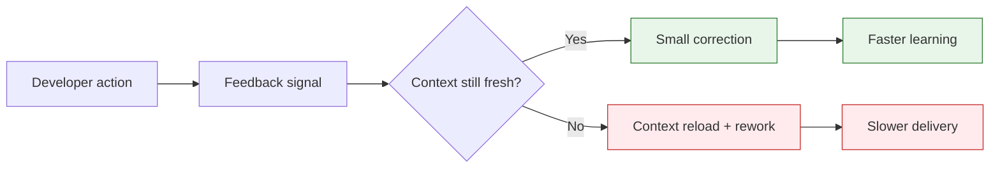
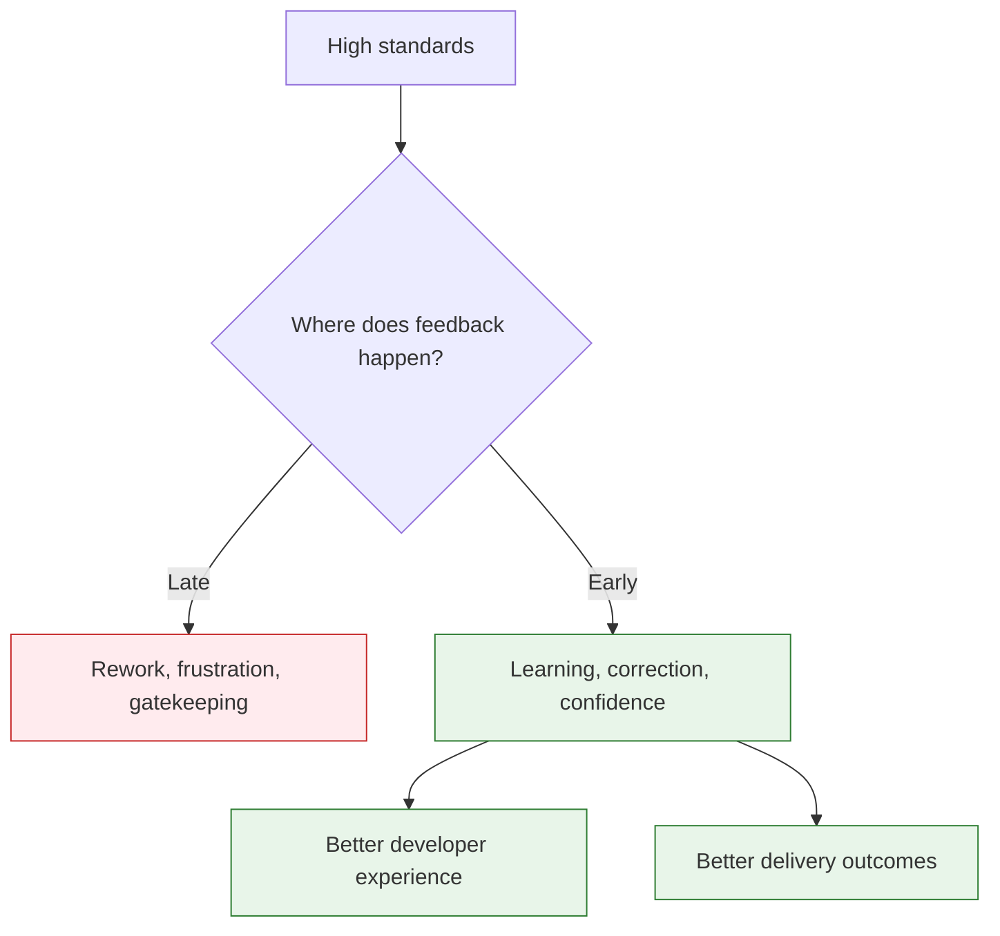
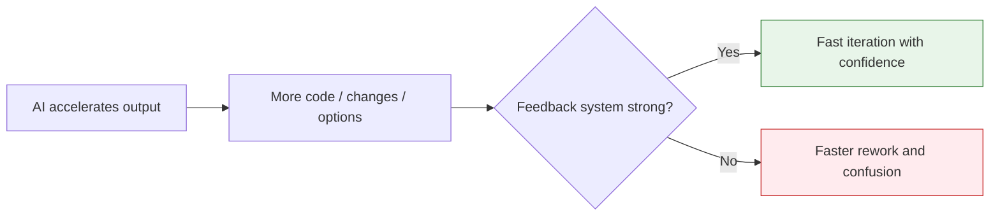

> A slow build is not just a slow build. A delayed code review is not just a delayed review. A flaky test is not just a flaky test. These are feedback loop problems — and feedback loop problems quietly become culture problems.
{: .prompt-warning }

Every engineering organization has places where developers wait.

They wait for CI to finish.  
They wait for code review.  
They wait for test environments.  
They wait for security approval.  
They wait for architecture decisions.  
They wait for production signals that tell them whether a change actually worked.

At first, this looks like normal delivery friction. Annoying, but manageable.

But waiting is not neutral.

When feedback arrives late, developers have already moved on. The mental model is gone. The branch has grown. The pull request is larger. The test failure now requires archaeology. The review comment lands after the author no longer remembers the trade-off. The security finding appears when the team is already trying to ship.

That is the hidden cost of slow feedback loops:

**They do not just delay work. They change how people behave.**

And once slow systems create slow behaviors, developer experience becomes an organizational problem — not a tooling problem.

## Feedback loops are everywhere in engineering

When people hear "feedback loop," they usually think about CI/CD. That is part of it, but the idea is much broader.

A feedback loop is the time between doing something and learning whether it worked.

| Action | Feedback signal |
|---|---|
| Write code | Unit tests, compiler errors, lint results |
| Open a pull request | Review comments, CI status, policy checks |
| Deploy a change | Telemetry, logs, alerts, user behavior |
| Propose an architecture | Decision, constraint, approved direction |
| Add a dependency | Security, license, and compliance result |
| Create a user story | Clarifying questions, acceptance criteria gaps |
| Use AI to generate code | Tests, review, static analysis, runtime behavior |

Engineering organizations are learning systems. Every loop is a learning channel.

When the loop is fast, teams learn while the context is still fresh.  
When the loop is slow, teams learn after the cost of change has already gone up.

This is why developer experience cannot be reduced to nicer tools or better dashboards. The real question is: **how quickly can an engineer learn whether they are moving in the right direction?**

## The visible delay is only part of the cost

A 45-minute build looks like it costs 45 minutes.

It does not.

The real cost includes the workarounds people create because the build is slow:

- They run tests less often.
- They batch more changes before pushing.
- They context-switch while waiting.
- They defer cleanup because rerunning validation is expensive.
- They treat CI as a final exam instead of a fast learning tool.

The same pattern shows up everywhere.

A two-day code review does not only delay merge time. It encourages larger pull requests, weakens ownership, increases merge conflicts, and makes feedback feel like interruption instead of collaboration.

A security scan that runs only at the end does not only find issues late. It teaches teams that security is a blocker, not a design input.

A production alert that lacks actionable context does not only slow incident response. It teaches engineers to distrust alerts.

The visible delay is the easy part to measure. The behavioral tax is where the real damage hides. This behavioral tax directly degrades the core dimensions of the **SPACE framework**—specifically **Flow/Efficiency** and **Satisfaction/Well-being**—while driving down your core **DORA metrics** like Lead Time for Changes and Change Failure Rate.

## Slow feedback creates rational but harmful behavior

Developers are rational.

If the build takes 45 minutes, they will avoid running it locally.  
If reviews take two days, they will pack more work into each pull request.  
If test environments are hard to get, they will share one fragile environment.  
If deployments are painful, they will deploy less often.  
If architecture decisions take weeks, they will either wait or quietly work around the process.

None of this means developers are careless. It means the system is teaching them what behavior is practical.

> Culture is not what the slide deck says. Culture is what the delivery system rewards.
{: .prompt-tip }

If small changes are slow, teams make big changes.  
If early feedback is expensive, teams wait for late feedback.  
If governance is manual, teams route around governance.  
If quality checks are flaky, teams stop trusting quality checks.

This is why slow feedback loops are an engineering leadership issue. Leaders do not just set goals; they shape the system of incentives around the work.

## The feedback loop tax

Slow loops create a tax that shows up in several forms.

| Hidden cost | What it looks like |
|---|---|
| Context switching | Developers start another task while waiting, then pay a mental reload cost later. |
| Larger batches | Teams combine unrelated changes because each validation cycle is expensive. |
| Shallow reviews | Reviewers face large PRs and focus on obvious issues instead of design quality. |
| Delayed learning | Teams discover requirement, architecture, quality, or security gaps too late. |
| Lower confidence | Flaky or slow signals become background noise instead of trusted feedback. |
| More coordination | Meetings and status checks compensate for systems that do not show progress clearly. |
| Cultural fatigue | Engineers start believing friction is simply "how things work here." |

The last one matters most.

Developer experience is not only about speed. It is about whether engineers feel the system helps them do good work. Slow feedback sends the opposite message: your time is cheap, your focus is interruptible, and learning can wait.

That message compounds.

### The compounding of Cognitive Load

Every broken or slow loop forces the developer to hold more state in their head. When an engineer has to juggle three active branches because they are waiting on a slow review loop for the first, a build loop for the second, and an environment allocation for the third, their cognitive capacity is entirely spent on process overhead instead of engineering logic. 

As a result, teams experience a silent drop in architectural quality and an increase in security oversights. You cannot optimize developer flow without actively budgeting and reducing this cognitive friction.

## Where feedback loops usually break

Most organizations do not have one giant bottleneck. They have many small loops that are each just slow enough to be annoying and collectively slow enough to change behavior.

### Local development

If setup takes days, onboarding becomes folklore. If running the app locally requires a secret handshake, developers avoid touching unfamiliar areas of the codebase.

Good local feedback means a developer can clone, configure, run, test, and debug without needing five people and a calendar invite.

### CI/CD pipelines

A slow pipeline is painful. A flaky pipeline is worse.

Slow pipelines delay learning. Flaky pipelines destroy trust. Once developers believe CI is unreliable, every red build becomes a negotiation: "Is this my change, or is the pipeline just having a day?"

That is not validation. That is roulette with YAML.

### Code review

Code review is one of the most important feedback loops in engineering, and one of the easiest to overload.

Large PRs, unclear ownership, timezone delays, style debates, and missing context all make review slower and less useful. Eventually, review becomes a gate instead of a conversation.

### Testing strategy

Tests are supposed to shorten feedback loops. But slow, brittle, or poorly scoped tests can do the opposite.

A healthy test strategy gives fast local confidence, meaningful integration coverage, and a smaller number of end-to-end tests that prove critical flows. An unhealthy one gives everyone a reason to skip the suite until the end.

### Security and compliance

Security feedback that arrives after implementation is expensive by design. The team has already made architectural choices, written code, and mentally moved on.

The goal is not to remove security gates. The goal is to move the useful part of security feedback earlier: secure templates, dependency policies, secret scanning, threat modeling prompts, and clear patterns that make the safe path easy.

### Architecture and decision-making

Slow architecture feedback is subtle but costly.

When teams cannot get timely decisions, they either pause delivery or make local decisions that may not fit the wider system. Both are expensive.

Architecture governance should clarify boundaries, not create decision fog.

### Production observability

Deployment is not the end of the loop. Production is where the system answers the most important question: did this change work for real users?

If telemetry is missing, noisy, or hard to interpret, teams learn too late. Incidents take longer. Product experiments become guesses. Reliability becomes reactive.

## Fast feedback is not the same as rushing

It is tempting to hear "faster feedback" as "move faster and skip rigor."

That is the wrong lesson.

Fast feedback is not about lowering standards. It is about moving standards closer to the work.

A test that runs in 30 seconds is more likely to be used than a test that runs in 30 minutes.  
A secure-by-default template is more effective than a late checklist.  
A small PR with clear ownership gets better review than a 2,000-line surprise.  
An actionable alert beats a dashboard nobody opens during an incident.

The strongest engineering systems make the right thing the easy thing.

This is the heart of developer experience leadership: do not ask teams to choose between speed and quality. Design systems where quality feedback arrives fast enough to shape the work while it is still cheap to change.

## What leaders should measure

Many organizations measure work completion but not waiting.

They know how many tickets closed. They know how many deployments happened. They know how many pull requests merged.

But they often do not know where engineers are waiting to learn.

Useful questions include:

| Question | Why it matters |
|---|---|
| How long does it take a new developer to make their first meaningful change? | Measures onboarding and local setup quality. |
| How long from commit to reliable CI result? | Measures code-level feedback speed. |
| How often does CI fail for reasons unrelated to the change? | Measures trust in automation. |
| How long does a PR wait before first review? | Measures collaboration latency. |
| How large are PRs when they reach review? | Reveals batching caused by slow loops. |
| How late do security issues appear? | Shows whether security is built in or bolted on. |
| How quickly can teams detect production impact? | Measures operational learning speed. |
| Which developer frustrations repeat every sprint? | Shows where the system is asking people to compensate manually. |

The point is not to create a surveillance dashboard. Please do not turn developer experience into a wall of red-yellow-green shame boxes.

The point is to find friction the organization can remove.

Measure the system, not the individual.

## How to shorten the loops

There is no single magic fix. Feedback loops improve through many small, intentional changes.

### 1. Reduce batch size

Small changes create faster feedback. They are easier to test, review, merge, deploy, and roll back.

If your process makes small changes expensive, developers will rationally create large ones. Fix the process, not the people.

### 2. Make CI fast and trustworthy

Invest in pipeline speed, test parallelization, caching, flaky test ownership, and clear failure messages. A fast pipeline that developers trust is one of the highest-leverage DevEx investments you can make.

### 3. Shift checks earlier

Move feedback left where it helps:

- Formatters and linters in the editor
- Fast unit tests locally
- Dependency and secret scanning before merge
- Secure templates at project creation
- Architecture guidance before implementation
- Observability built into service templates

Earlier feedback is cheaper feedback.

### 4. Create golden paths (and treat them as products)

A paved road is a feedback loop accelerator. Standard templates, secure-by-default deployment pipelines, and observability defaults make it easier to deliver software safely. 

But the critical transition for transformation leaders is treating these golden paths as **internal products**, not mandates. If the paved road is not the fastest, easiest, and most delightful option, developers will carve their own trails. The platform engineering team's primary metric should be the adoption rate of their paved roads, driven by customer satisfaction (developer enablement) rather than policy enforcement.

### 5. Improve review norms

Code review should optimize for useful feedback, not ritual approval.

That means clear ownership, small PRs, reviewer expectations, automated style checks, and a shared understanding of what belongs in review versus what should be handled by tools.

Humans should spend review time on design, correctness, maintainability, and risk — not whitespace arbitration.

### 6. Close the loop on developer friction

If engineers keep raising the same pain points and nothing changes, they stop raising them.

A strong DevEx function does not only collect feedback. It closes the loop: what was heard, what changed, what is next, and what trade-offs were made.

Developer trust improves when feedback leads to visible action.

## AI makes feedback loops more important, not less

AI-assisted development changes the economics of software delivery.

Code generation gets faster. Exploration gets faster. Refactoring gets faster. Documentation drafts get faster. Test scaffolding gets faster.

AI-assisted tools accelerate output at the keyboard, but they do not automatically accelerate delivery to production. In fact, generating software faster in an organization with slow verification systems is highly destabilizing. It is the equivalent of putting a V8 engine in a car with broken brakes.

To survive and thrive in the age of AI-assisted engineering, leaders must realize that **the bottleneck has shifted from typing to verifying**. If your validation loops are manual or slow, AI will simply pile up unverified inventory, creating congestion, PR queues, and massive merge conflicts downstream.

In the AI era, feedback loops become even more important because they are the control system around accelerated work.

This is why AI adoption belongs in the developer experience conversation. It is not just a coding assistant rollout. It is a stress test of the engineering system around it.

Teams with fast tests, clear standards, good observability, and strong review practices will get more value from AI. Teams with slow feedback loops will simply generate uncertainty faster.

## The 1-Hour Feedback Loop Value-Stream Map

To locate high-leverage opportunities, run a structured diagnostic session rather than a general retrospective:

1. **Track a Single Commit:** Trace one standard feature ticket from the first `git commit` to verified production execution.
2. **Segment Active vs. Idle Time:** Map the timeline, distinguishing active coding/testing time from waiting on reviews, pipelines, or provisioning.
3. **Calculate Loop Efficiency:** Divide the active contribution time by the total cycle time. In friction-heavy organizations, developer efficiency is often under $15\%$.
4. **Target the Longest Idle State:** Don't try to fix the entire pipeline. Target the single largest wait state and automate or delegate the bottleneck in your next two-week iteration.

Do not start with a transformation program. Start with one loop.

For example:

| Wait state | Feedback needed | Possible improvement |
|---|---|---|
| Local setup took two days | Can the service run locally? | Dev container, setup script, better README |
| PR waited 36 hours | Is the change acceptable? | Review ownership, smaller PRs, review SLA |
| CI failed twice for unrelated reasons | Is the change safe? | Flaky test quarantine and ownership |
| Security finding appeared late | Is the dependency allowed? | Pre-merge dependency policy check |
| Incident root cause took hours | What changed and what broke? | Deployment markers, better service telemetry |

This exercise works because it moves the conversation from vague frustration to system design.

## The takeaway

The fastest teams are not the teams that type code the fastest.

They are the teams that learn the fastest.

They learn quickly whether code works, whether tests are meaningful, whether a design fits, whether a change is secure, whether production is healthy, and whether developers are fighting the system or flowing through it.

Slow feedback loops quietly tax every part of engineering: focus, quality, collaboration, morale, and trust.

Developer experience improves when leaders stop treating waiting as normal and start treating it as a design problem.

Because every place an engineer waits to learn is a place the organization can get better.

---

*Where does your team wait the longest — builds, reviews, environments, approvals, or production feedback? That is probably where your next developer experience investment should start.*
